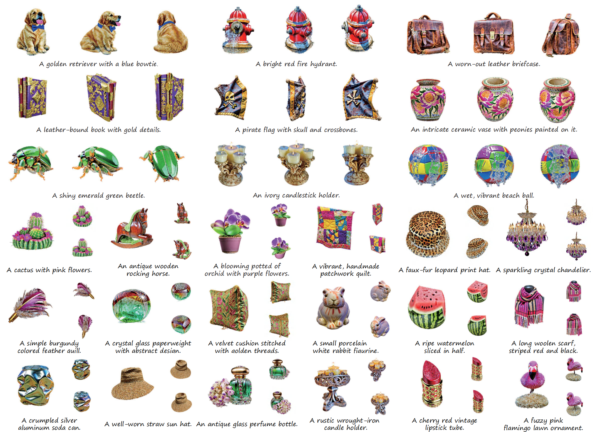

# PlacidDreamer
#### Shuo Huang, Shikun Sun, Zixuan Wang, Xiaoyu Qin, Yanmin Xiong, Yuan Zhang, Pengfei Wan, Di Zhang, Jia Jia (Corresponding author). *Tsinghua University & Kuaishou.* ####

The official implementation of ACM Multimedia 2024 paper "PlacidDreamer: Advancing Harmony in Text-to-3D Generation".

---

<div align=center>
  
  
Examples of text-to-3D results of PlacidDreamer, within **~25mins** on A100.

</div>


### 2D Score Distillation Experiments
<div align=center>
 

Examples of 2D generation results of SDS (left) and BSD (right). 
</div>

Sharing the same computational costs as SDS, BSD is able to reconstruct images that are much more similar to those produced by diffusion sampling.

Try:
```bash
cd Balanced_Score_Distillation
sh run.sh
```

### Installation

```
git clone https://github.com/HansenHuang0823/PlacidDreamer.git --recursive
conda create -n PlacidDreamer python=3.10.13 cudatoolkit=11.8
conda activate PlacidDreamer
pip install -r requirements.txt
pip install submodules/diff-gaussian-rasterization/
pip install submodules/simple-knn/
```

### Inference
```bash
### Image to multi-view images + mesh reconstruction
### GPU requirements: 30GB
### cactus.png ---> multiview_images/cactus/*.png + mesh/cacuts.obj
python imagetomesh.py --elev 10 --im_path cactus.png

### Finetune text-to-image diffusion models
### multiview_images/cactus/*.png ---> lora_checkpoints/cactus
sh train_dreambooth_lora.sh

### Balanced Score Distillation
# Standard BSD with guidance ratio that classifier : smoothing = lambda_ : 1. You can control the saturation.
python train.py --opt configs/cactus.yaml --lambda_ 18.0 --name cactus --lora_path lora_checkpoints/cactus

# A variation of BSD using SDS decomposition. This is equivalent to standard BSD with an automatically increasing lambda. While you cannot control saturation anymore, it mostly achieves satisfactory saturation.
# See explanation below.
python train.py --opt configs/cactus.yaml --auto_BSD true --name cactus --lora_path lora_checkpoints/cactus
```

### Evaluation on T3Bench
We show the training configs and scripts on T3Bench at `configs` and `scripts` folders. Due to version updates, it is necessary to modify the storage path of the program output to ensure the pipeline runs smoothly.
```bash
### Evaluation of quality.
python T3Bench_Evaluation/eval_quality.py
### Evaluation of text alignment.
python T3Bench_Evaluation/eval_blip.py
# Replace the placeholder with your own GPT-4 api-key.
python T3Bench_Evaluation/eval_alignment.py
```

### Credits
This codebase is built upon the [LucidDreamer](https://github.com/EnVision-Research/LucidDreamer). Thanks to the authors for their great codebase and contribution to the community.